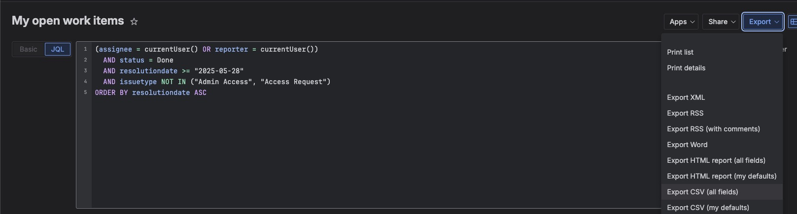

# Annual Review Toolkit

Scripts for generating quantitative data for an annual performance review.
Pulls GitHub PR activity, JIRA ticket work, and Confluence contributions into
a single Markdown report you can paste directly into Confluence or Notion.

**What you get:**
- PR counts, merge rate, code churn, time-to-merge, size distribution, reviewer breakdown
- JIRA ticket stats: issue types, priorities, story points, cycle time, epics
- Sprint contribution — your story points vs team total, per sprint
- Confluence pages created and edited, by space, content type, and activity timeline
- A single `data/<login>_review.md` export covering all three sections

---

## Dependencies

| Tool | Install | Used for |
|---|---|---|
| **Python 3.10+** | `brew install python` | All analysis scripts |
| **GitHub CLI (`gh`)** | `brew install gh` | Fetching PR data |
| **Miller (`mlr`)** | `brew install miller` | Stripping JIRA CSV columns |

Verify:
```bash
python3 --version   # 3.10+
gh --version
mlr --version
```

---

## Setup

### 1. Authenticate the GitHub CLI

```bash
gh auth login
```

Select **GitHub.com** → **SSH** → follow prompts. Verify with:

```bash
gh auth status
```

The scripts use your authenticated identity automatically. To run for a different
person, pass `--author <github-login>` — they must be a member of the org.

### 2. Configure JIRA / Confluence credentials (optional)

Required for sprint contribution %, team story points, and Confluence analysis.
All three sections use the same Atlassian API token.

```bash
cp .env.example .env
```

```ini
# .env
JIRA_URL=https://your-org.atlassian.net
JIRA_EMAIL=you@your-org.com
JIRA_TOKEN=your-api-token-here
```

Get an API token at: **Atlassian account settings → Security → API tokens**

`.env` is gitignored — never commit it.

---

## Quick Start

```bash
# GitHub PRs only
./scripts/collect_author.sh <github-login> --org my-company --since 2025-01-01

# GitHub PRs + JIRA + Confluence + Markdown export
./scripts/collect_author.sh <github-login> --org my-company --since 2025-01-01 --jira --confluence --export-md

# Re-fetch everything from scratch (ignore cache)
./scripts/collect_author.sh <github-login> --org my-company --since 2025-01-01 --jira --confluence --export-md --force
```

**Flags:**

| Flag | Description |
|---|---|
| `--since YYYY-MM-DD` | Only include activity from this date onwards |
| `--org <github-org>` | Limit PR discovery to this GitHub org (e.g. `my-company`). Omit to include all orgs. |
| `--jira` | Strip `JIRA.csv` and run JIRA analysis (requires `JIRA.csv` in repo root — see below) |
| `--confluence` | Fetch and analyse Confluence contributions (requires `.env` credentials) |
| `--confluence-email` | Atlassian email of the person to fetch Confluence pages for (default: `JIRA_EMAIL`) |
| `--export-md` | Generate `data/<login>_review.md` after all steps complete |
| `--force` | Re-fetch all data even if cached output files already exist |

Output files are written to `data/` (gitignored):
```
data/<login>_prs.json
data/<login>_reviewed_prs.json
data/<login>_jira.csv               (--jira)
data/<login>_sprint_totals.json     (--jira, with .env credentials)
data/<login>_confluence.json        (--confluence)
data/<login>_review.md              (--export-md)
```

---

## GitHub PR Analysis

### What it measures

- **Authored PRs** — count, merge rate, code churn, time-to-merge, size distribution, reviewers
- **Reviewed PRs** — volume, verdicts given, authors reviewed

### Running manually

```bash
python3 scripts/fetch_prs.py --author <login> --org my-company --since 2025-01-01
python3 scripts/fetch_reviewed_prs.py --author <login> --org my-company --since 2025-01-01
python3 scripts/analyse_prs.py --author <login> --org my-company
```

The default `--since` date is set in `scripts/pr_utils.py` — update `START_DATE` for your
review period. Fetched data is cached in `data/`; re-running analysis is instant.

---

## JIRA Analysis

### Step 1 — Export your tickets from the JIRA UI

1. Open JIRA → **Issues → Advanced issue search**
2. Switch to **JQL mode** (top-right of the search bar)
3. Paste this [query file](queries/completed-tickets.jql) (adjust the date to your review start):
   ```jql
   (assignee = currentUser() OR reporter = currentUser())
     AND status = Done
     AND resolutiondate >= "2025-01-01"
     AND issuetype NOT IN ("Admin Access", "Access Request")
   ORDER BY resolutiondate ASC
   ```
4. Click **Export** (top-right) → **Export CSV (all fields)**
5. Save as **`JIRA.csv`** in the repo root

> **Important:** choose "all fields" — the strip script selects the relevant columns.
> A partial export may be missing Sprint or Story Points.

The JQL query is also saved in `queries/completed-tickets.jql`.



### Step 2 — Strip and analyse

```bash
bash scripts/strip_jira.sh --author <login>
python3 scripts/analyse_jira.py --author <login>
```

### Step 3 — Sprint contribution (optional, requires `.env`)

Fetches team ticket and story point totals per sprint from the JIRA API, so you
can see your share of each sprint's completed work. The story points field is
auto-discovered from your JIRA instance — no configuration needed.

```bash
python3 scripts/fetch_sprint_totals.py --author <login>
python3 scripts/analyse_jira.py --author <login>   # re-run to pick up totals
```

Sprint totals are cached in `data/<login>_sprint_totals.json`.

---

## Confluence Analysis

Fetches pages you created and pages you edited (others' pages). Produces a
breakdown by space, content type, and activity timeline, plus a version history
for pages you own.

Requires the same `.env` credentials used for JIRA.

```bash
python3 scripts/fetch_confluence.py --author <login> --since 2025-01-01
python3 scripts/analyse_confluence.py --author <login>
```

Data is cached in `data/<login>_confluence.json`. Pass `--force` to re-fetch.

---

## Exporting to Markdown

Generates a single Markdown file covering all three sections. Sections whose
data files are absent are skipped automatically.

```bash
python3 scripts/export_markdown.py --author <login> --since 2025-01-01
# → data/<login>_review.md
```

Bar charts from the terminal output are replaced with `%` columns in tables,
which render cleanly in any Markdown viewer.

**To paste into Confluence:** open the target page → `...` menu → **Edit** →
switch to **Markdown** editor → paste the file contents. All tables, headings,
and emphasis render natively.

---

## Running for a Colleague

You can use **your own API token** — no need to share credentials. GitHub PRs
are fetched by `--author` login. For Confluence, pass `--confluence-email` so
the scripts query the colleague's pages rather than yours. `.env` stays
unchanged.

To export your colleague's data, change the JQL `currentUser()` to their actual `Username` to export their own `JIRA.csv` (see
[JIRA Analysis → Step 1](#step-1--export-your-tickets-from-the-jira-ui)) and
place it in the repo root, then run:

```bash
./scripts/collect_author.sh their-github-login \
  --since 2025-01-01 \
  --jira \
  --confluence --confluence-email their-atlassian@your-org.com \
  --export-md
```

Output is written to `data/their-github-login_review.md`; all intermediate
files are scoped to their login so your own cached data is unaffected.

## Caching

All fetch scripts write their output to `data/` and skip the network on
subsequent runs. Pass `--force` to any fetch script to re-fetch from the API.

`data/` is gitignored — all outputs are local only.
